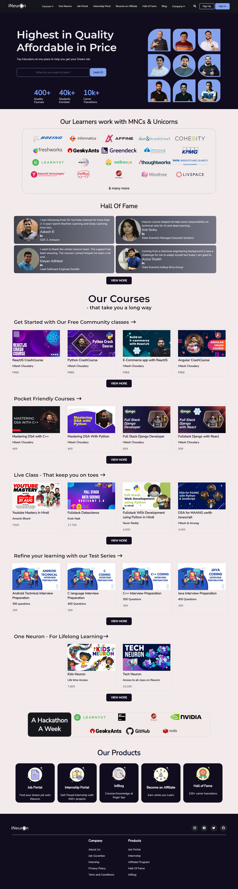

## iNeuron Homepage

This is the webpage I designed and Developed during the Hackathon conducted by iNeuron.
Used on HTML and CSS

### My Design Process
#### My process started with finding bad design and not so good UX issues in iNeuron's homepage. 

Things I found
- Navigation bar looks to big to me, and it's not stick to top.
- Dropdown menu activates when hovers but stays when we move to other or when we click anywhere on screen.
- It's main banner has three sliding images, may be because of colors they used or images they used, I'm not attracted to it.
- In second section of 100vh - it has information of their courses, students enrolled, carrer transitions, I felt its too much space for that little information.
- Hall of Fame, companies students work has flowing images, but it took more space. and they are not visually attractive.
- In courses sections, I felt the cards are too big( only 3 cards for less informtion).
- Hackathon section has flowing images of companies, 
- Most important thing I observed is, their headings are too big, and margin between heading and content is also more.
- Footer section doesn't look organized. ISO certificte is too big compared to others.
- It's scroll bar doesn't match with other colors on website.

> Disclaimer : I'm not a professional UI/UX designer, these are my thoughts as an user. And a developer's aim to make it little better with my limited knowledge.

> Due to time constraints in hackathon -- This site is not responsive at the moment.

#### How I improved it
- I reduced the navigation bar height by adjusting font-sizes and gaps. Rather than search bar, used search icon.
- Dropdown menu only appears when hover and disapper when normal.
- 
- Used dark colors for navbar and header section, which I felt attractive.
- On one side, I gave the companies motto using formal font, search option and courses,students number (for which they wasted 100vh)
- On other side their educators with some funky shapes to show Quality and Joyfull Learning at One palce.
- Using `display:flex` I gave students working companies in one place than having flow.
- For Hall of Fame section, I want that to stand out of all the other items as it is an imporant project to them. I gave horizantal cards than vertical ones, and View More button , which takes to their HallOfFame page.
- As they have dedicated webpage for courses, than flooding the homepage with courses, I restricted myself to 4cards with view more button. Used `box-shadow` property to highlight when hover over them.
- I really like the Free hackathons they conduct in their office. Than having a heading and some cards, I wanted it to be unique, same as their approch of giving back to community. Thats why I choose to have heading "A Hackathon A Week" and its alignment with companies card.
- I gave same background color of header section to Our products to show its importance.
- Reduced the headings font size, and its margin.

### Time spent: 12 hours
Spent more time in brainstroming and aligning the content for better User Experience.
### Learnt:
 - Learnt a lot about designing, how to think around, how to get inspiration from not just other edtech platforms but also from daily used ones like zomato, Instagram,Github etc.,
 - How to make drop down menu.
 - USing limited tool to build better products.

### [LiveLink](https://ineuron-homepage-vivekn.netlify.app/)

 ### QuickLook:
 

